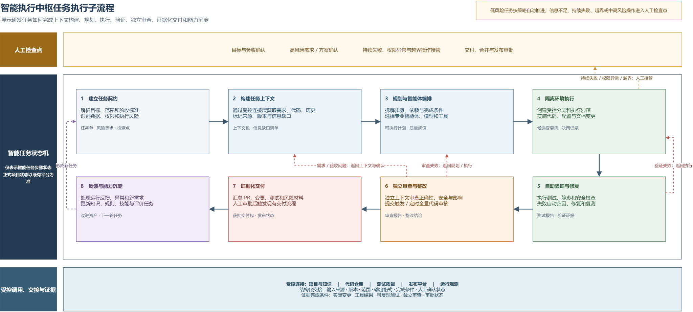
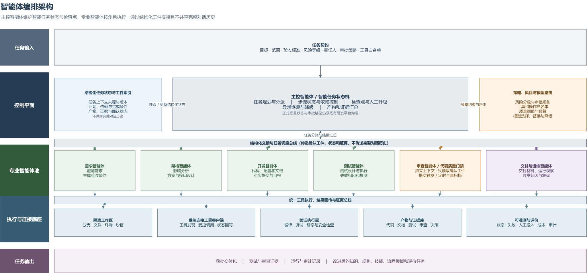
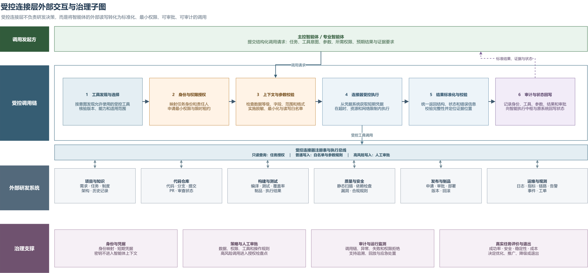

# 从单点辅助到可信协同：金融科技 AI 研发工作流设计与实践

> 本文对业务系统、技术平台、模型和工具名称作功能化匿名处理。

## 摘要

人工智能已经可以辅助分析需求、编写代码、生成测试和开展代码审查，但在实际研发中，完成一次生成并不等于完成一项任务。一个可交付的研发任务还需要明确范围，调用项目和代码资料，经过测试、审查和审批，并形成可以复核的过程记录。针对金融科技研发流程长、涉及系统多、安全要求高，以及存量系统资料不完整等问题，团队建设了一套可信 AI 研发工作流。该工作流由智能执行中枢、受控连接层和人工检查点组成，让不同职责的智能体在规定范围内完成分析、开发、测试和审查，并以实际变更、测试结果、审查记录和审批状态证明任务已经完成。

目前，AI 代码审核和研发系统受控连接等基础能力已经投入使用，需求、设计、开发、测试、审查和交付流程已经贯通，并支持过程留痕与任务回放。团队通过两个真实任务验证了这套方法：在一个只有约 3 万行源码和少量资料的存量金融业务系统中，完成需求逆向、重新设计、整系统重写、测试审核、内部验收和上线运行；针对开源组件漏洞，在全机构数十个项目中完成影响排查，并在试点项目中完成升级整改、测试和代码审核。实践表明，AI 在研发中的价值不应只看生成速度，更应看它能否在安全、质量和责任要求下完成真实任务，并把有效做法沉淀为可复用的组织能力。

**关键词：** 人工智能；AI 研发工作流；多智能体协同；代码审核；研发效能；自主可控

## 一、应用背景：从分散辅助走向受控交付

一项金融科技研发任务通常要经过需求分析、方案设计、代码开发、测试、审查、发布和运行维护。任务信息、源代码、测试结果和审批记录往往保存在不同平台中，研发人员需要反复查找、核对和搬运资料。现有 AI 工具虽然能够解释代码或生成内容，但多数仍用于某一个环节：它不了解任务的完整过程，也不能仅凭一次回答证明代码可以运行、测试已经通过或风险已经得到处理。

对于长期演进的存量系统，问题更加突出。原始需求、设计资料和人员经验可能逐步流失，系统真实规则分散在代码、数据校验和接口调用中。对于漏洞处置等跨项目任务，影响范围、整改进度和验证证据又容易散落在多个团队和平台。传统自动化适合执行固定规则，却难以连续完成跨文档理解、任务拆解、影响分析、代码修改和交付材料汇总。

当智能体开始使用代码仓库、终端和项目平台后，新的风险也随之出现。项目资料可能包含敏感信息，错误指令可能修改不应修改的文件，过大的系统权限还会放大模型判断错误。如果没有明确的任务范围、操作权限、质量要求和审批责任，自动化越深入，数据泄露、误操作和责任不清的风险就越高。

因此，本项目不是简单增加几个 AI 功能，也不以“无人研发”为目标。团队希望在保留既有研发平台、审批流程和人员责任的前提下，让 AI 能够连续处理一项任务：按权限获取所需资料，完成代码变更后自动测试和审查，遇到高风险事项交由人员决定，最后用代码、测试、审查和审批记录说明任务是否真正完成。

## 二、技术方案：智能执行、受控连接与人机协同

### （一）以研发生命周期为主轴的总体架构

这套工作流不替换现有的项目管理、代码、测试和发布平台，而是在这些平台之上增加智能执行和受控连接能力。现有平台继续保存正式任务、审批结论和责任人信息；智能执行中枢负责理解任务、安排步骤、调用专业智能体并汇总结果；受控连接层负责访问外部研发系统，同时检查身份、权限和调用参数，并记录操作；需要人员判断的需求确认、高风险方案、代码合并和生产发布仍由相关责任人决定。

*图 1　AI 增强研发全生命周期总图*

如图 1 所示，工作流仍按照任务受理、需求分析、方案设计、开发实施、测试验证、审查验收、发布交付和运行反馈推进。智能执行中枢在每个阶段承担可以交给 AI 的工作，受控连接层提供项目资料、代码仓库、构建测试、质量安全和运行监控等系统的访问能力，人工检查点保留关键业务和风险决策。

三类角色形成明确分工：AI 负责理解、分析、生成和解释；编译、测试、覆盖率和安全扫描等确定性程序负责验证；授权人员负责业务语义、风险接受和生产操作决策。智能执行中枢中的步骤状态只表示 AI 任务进度，不能替代既有研发平台中的正式项目状态和审批结论。

### （二）从任务受理到证据化交付

每项任务开始前，都要先写清楚要解决什么问题、哪些内容不在本次范围内、什么结果才算完成，以及哪些操作必须经过人工审批。同时明确需要读取哪些资料、允许使用哪些工具、最终应提交哪些材料。这份任务说明为智能体划定了工作边界，避免执行过程中偏离目标。

任务开始后，受控连接层根据权限读取需求、代码、历史修改、测试结果和项目规则。智能执行中枢标记资料来源、版本和缺口，拆分工作步骤，并将需求分析、设计、开发、测试和审查工作分配给相应的专业智能体。如果资料不足，系统会明确指出缺少什么信息，并转入人工确认，而不是自行补造结论。

代码、配置和文档修改在隔离的工作分支和受控环境中进行。修改完成后，系统自动执行编译、单元测试、集成测试、静态检查和安全检查。检查失败时，工作流先判断问题来自需求、方案、实现、测试还是外部工具，再返回相应环节修改并重新验证。连续失败、信息不足或风险上升时，系统停止自动推进，由人员决定继续、调整方案、降级处理或终止任务。

自动检查通过后，独立审查智能体重新对照需求、代码差异、测试结果和项目规则进行检查。只有实际修改、可复现的测试结果、独立审查结论、阻断问题处置结果和必要的人工审批均已具备，任务才进入交付阶段。系统将变更说明、测试报告、审查问题及处理结果、发布方案和回滚措施整理为交付材料，供责任人验收。

*图 2　智能执行中枢任务执行子流程*

### （三）结构化交接、定向返工和任务回放

不同智能体之间不直接传递不断增长的完整对话记录，而是通过需求说明、设计方案、代码差异、测试报告和审查结论等结构化交付物交接。每份材料都标明来源、版本、适用范围、完成条件和人工确认状态。这样既减少长任务中的上下文失真，也使测试和审查智能体能够依据同一组已确认事实独立判断。

任务是否完成不能由模型自己决定。“已经生成文档”或“代码看起来正确”都不是完成依据。工作流必须看到与目标对应的实际变更、关键工具执行记录、可复现且达标的测试或扫描结果、独立审查结论，以及必要的人工审批状态。这些材料共同构成证据链，使完成条件从主观判断转变为可检查的事实。

失败后也不简单从头重跑。需求语义或验收条件不清楚时，返回需求分析和人工确认；架构、接口或兼容性有问题时，返回方案设计；实现、测试或代码质量有问题时，返回开发和测试环节；工具权限不足或外部系统异常时，暂停调用并记录原因。这种按原因定向返工的机制，既允许 AI 自主修复低风险问题，也避免在错误目标或错误权限下反复执行。

工作流保存任务使用的资料、执行步骤、工具调用、测试结果、审查结论和人工确认记录，支持对代表性任务进行回放。回放不是重新展示模型对话，而是核对每个环节是否使用了正确资料、调用是否符合权限、质量门禁是否真实执行、失败是否按规则返工，以及人工责任是否落实。

### （四）多智能体协同与独立审查

平台没有让一个智能体从头到尾处理所有工作，而是按照研发职责设置主控智能体和多个专业智能体。主控智能体负责任务拆解、依赖管理、检查点控制、异常处理和结果汇总；需求、架构、开发、测试、审查和交付智能体分别处理各自擅长的工作。它们共享经过权限控制的任务资料、阶段成果和证据，但正式状态、审批结论和责任人仍以现有研发平台中的记录为准。

*图 3　智能体编排架构*

开发和审查由不同智能体承担。审查智能体不直接继承开发过程中的全部推理，而是重新读取已确认需求、实际代码差异、测试结果和项目规则，从正确性、安全性、完整性和变更影响等角度独立判断。严重问题必须整改并重新审查，一般问题由人员确认如何处理，从机制上避免“自己开发、自己证明正确”。

平台可以根据任务类型、数据敏感程度、模型稳定性、使用成本和操作风险选择不同模型，但工具权限、审批规则和质量标准始终由团队管理。模型和工具可以替换，已经形成的任务规范、测试门禁、审查规则和责任体系保持不变。

### （五）受控连接层与分级权限

智能体不能直接持有各研发系统的账号和密码，也不能绕过权限控制访问数据。所有外部访问都经过受控连接层。一次调用需要完成身份映射、最小权限授权、上下文与参数检查、连接器执行、结果完整性校验、调用审计和必要的状态回写。外部系统凭据由连接层或既有凭据系统统一保管，不写入提示内容、代码或交付材料。

*图 4　受控连接层外部交互与治理子图*

连接层将外部操作划分为三个等级。只读查询用于读取需求、代码和测试结果，按任务授权范围执行；普通写入包括创建分支、提交任务状态等操作，受到工具白名单和参数规则约束；高风险写入包括代码合并、生产发布、生产数据和权限变更，必须进入人工审批。这样既让智能体可以完成必要操作，又避免其获得长期、无边界的高权限。

目前，受控连接层已经能够连接代码仓库、项目管理等研发平台，并按权限读取或回写任务、代码和状态信息。整体研发流程已经贯通，关键操作有记录可查；但不同环节的长期成功率、常见失败原因和人工介入比例仍在持续统计。流程贯通并不等于所有环节都已经达到相同的稳定程度。

### （六）贯穿研发过程的 AI 代码质量门禁

AI 代码审核是工作流中的公共质量节点，而不是独立案例。开发人员或智能体提交代码、发起合并请求后，平台通过受控连接层获取本次代码差异、相关文件、任务说明和项目规则。审查智能体检查功能正确性、安全问题、异常处理、边界条件、代码可维护性、测试是否充分以及修改可能影响的范围，并将问题位置、严重程度和修改建议回写代码平台。

严重问题必须返回开发环节整改，整改提交会再次触发复核；一般问题由责任人员确认处置。除每次提交自动触发审核外，平台还可以按计划对项目进行全量扫描。这项能力同时服务两个案例：在存量系统重写中检查新代码是否符合已经确认的需求和设计，在组件漏洞整改中确认漏洞是否消除、依赖是否完整升级以及是否出现兼容性问题。

工作流由此形成两个相互关联的循环：研发交付循环负责完成真实任务，能力改进循环根据运行记录、失败复盘和效果评价更新知识、规则、审核模式和流程模板。经过验证的能力可以推广，不稳定或风险过高的能力则被调整、降级或停用。

## 三、实践案例一：某存量金融业务系统的需求逆向与整系统重构

### （一）案例背景

某存量金融业务系统已经运行多年，熟悉原系统的人员和设计资料不足，能够使用的主要材料是约 3 万行源码和少量项目文件。现有需求文档有缺失，也有部分描述与代码实际行为不一致。大量业务规则分散在数据校验、接口调用和页面交互代码中。按照传统方法，研发人员需要逐个文件阅读，再依靠个人经验还原系统功能，不仅耗时，也容易遗漏规则和低估修改影响。

本次项目不是简单整理旧代码，也不是让 AI 直接生成一套新系统。团队先从代码中恢复可以核实的需求，再由业务人员确认关键规则，在此基础上重新设计并重写整个系统。项目已经完成需求逆向、方案设计、开发、单元测试、集成测试、代码审核和交付门禁，通过内部验收后上线，目前运行正常。

### （二）实施过程

项目开始时，团队先明确系统范围、需要恢复的业务功能、验收要求和安全限制。为了让智能体能够处理较大的代码库，平台按照模块、调用关系和依赖关系整理源码。智能体每次只读取当前任务需要的部分，并记录代码来源和版本，避免因为一次输入过多而遗漏关键信息。

随后，需求智能体从源码中查找业务规则、校验条件、接口行为和页面流程，形成需求说明初稿。每项结论都明确区分为可以由代码直接证明的事实、根据代码作出的推断，或者需要人员进一步确认的事项。独立的需求审查智能体再检查内容是否完整、能否测试以及是否存在安全问题，关键业务含义由业务人员最终确认。这样既能够利用代码恢复需求，又不会把历史代码中的所有行为直接当作正确需求。

开发采用测试驱动方式。团队先根据已经确认的需求编写并运行单元测试，保留预期失败记录，再编写实现代码直至测试通过。独立审查角色检查测试是否覆盖主要业务规则和边界情况，并识别没有有效断言、只为提高覆盖率而编写的无效测试。项目设置了单元测试覆盖率门禁，门禁阈值及统计范围在正式申报材料中将与测试报告一并说明，不把覆盖率数字直接推导为效率或质量提升比例。

单元测试通过后，团队围绕跨模块业务流程开展集成测试和关键路径冒烟测试。发现问题时，先补充能够复现问题的测试，再修改代码并重新运行相关测试。阻断和严重问题必须整改并重新审查。代码提交后自动触发 AI 审核，检查功能正确性、安全性、异常处理和项目规则。只有测试、审查和严重问题处理均达到要求，项目才进入人工验收和上线流程。

### （三）四类交付资产

项目最终交付的不只是新系统代码，还形成了四类能够继续维护和复用的资产：

1. **需求与规则资产**：需求规格、业务规则、事实与推断的区分、待确认事项及人工确认记录。
2. **设计与接口资产**：系统结构、模块职责、调用关系、接口、数据对象和关键设计决定。
3. **实现与验证资产**：实现代码、单元测试、集成测试、覆盖率报告、执行记录和独立审查报告。
4. **交付与运维资产**：变更说明、部署与回滚材料、风险说明、维护交接和后续演进建议。

原来分散在源码和个人经验中的系统知识，由此转化为后续维护人员可以查阅、执行和验证的项目资产。该案例说明，AI 可以参与复杂存量系统从理解到重建的完整过程，但前提是每一步都有明确输入、检查要求和责任人：AI 从代码中提出需求，业务人员确认关键含义；测试把确认后的需求转化为自动检查标准；独立审查再判断实现是否偏离目标。

## 四、实践案例二：开源组件漏洞全机构排查与试点整改

### （一）案例背景

金融科技系统普遍使用开源组件。收到漏洞通告后，需要尽快确认哪些项目使用了相关组件，属于直接依赖还是间接依赖，当前版本是否受影响，以及哪些项目需要优先处理。项目数量较多时，完全依靠人工查询和逐一沟通，不仅速度慢，排查结果、整改进度和剩余风险也容易散落在不同人员和系统中。另一方面，直接批量升级组件可能造成构建失败、接口不兼容或业务回归，因此不能只根据版本号自动修改。

团队在一次真实漏洞处置任务中，对全机构数十个项目进行了影响排查，并选择试点项目完成组件升级、相关代码调整、测试和代码审核。这个案例用于检验同一套工作流能否处理跨项目的安全任务。

### （二）实施过程

收到漏洞通告后，团队先明确漏洞等级、排查范围、完成时限和验收要求。受控连接层读取组件清单、依赖扫描结果和代码仓库信息，智能执行中枢据此识别直接依赖、间接依赖和受影响版本，并按项目形成影响分析和整改任务。

架构和开发智能体分析可用修复版本、接口变化、构建限制以及升级可能带来的业务影响。试点项目的组件升级以及相关代码、配置和构建文件修改都在独立分支中完成，并依次进行构建、单元测试、集成测试和关键业务回归测试。测试失败时，工作流分析原因、调整方案并再次测试，不会为了赶进度跳过失败项。

每次整改提交都会自动进入 AI 代码审核，重点确认漏洞是否已经消除、依赖是否完整升级，以及新版本是否带来兼容性或其他安全问题。项目负责人负责批准代码合并和发布；风险较高或兼容性仍不明确的项目转为专项人工处理。排查和整改状态写回现有平台，已验证的升级方法和常见问题用于后续项目。

### （三）交付结果与事实边界

该案例形成了项目排查清单、依赖与影响分析、试点整改分支和提交记录、测试报告、审核结论、剩余风险及发布建议。过去需要分别查询和记录的信息被纳入同一任务链管理，系统可以为不同项目分别安排任务，但每个项目仍要单独测试、审查和审批，避免一次自动操作影响多个项目。

需要特别说明的是，本次实践完成的是“全机构项目排查和选定试点项目整改”，不能扩大表述为所有受影响项目均已完成整改。该边界既反映真实实施状态，也说明跨项目自动化必须尊重各项目的兼容性差异和责任关系。

## 五、实施效果：从真实交付到组织能力

两个案例分别验证了工作流在复杂存量系统重构和跨项目安全整改中的适用性，公共代码质量门禁则证明质量能力可以在不同任务中复用。由于部分量化指标仍在统一统计口径，本文优先使用能够核验的状态变化和证据类型，不采用“效率提升数倍”等缺少统一基线的结论。

### （一）案例实施前后状态对比

| 对比维度 | 实施前 | 实施后 | 判断依据 |
| --- | --- | --- | --- |
| 需求与系统认知 | 资料缺失或与代码不一致，业务规则依赖源码和个人经验 | 形成区分代码事实、模型推断和人工确认的需求与规则 | 需求说明、确认及审查记录 |
| 设计与知识传承 | 模块、调用关系、接口和重要设计决定缺少完整说明 | 形成新系统结构、接口和关键设计说明 | 设计、接口及交接材料 |
| 测试保障 | 测试和回归验证不足，主要依赖人工经验 | 建立测试驱动开发、单元测试、集成测试和问题复测流程 | 测试执行及覆盖率报告 |
| 代码质量控制 | 质量检查分散，依赖人员主动发起 | 每次提交可自动触发独立 AI 审核，严重问题必须整改 | 审核及整改记录 |
| 存量系统交付 | 原系统知识难以继承，维护风险较高 | 完成整系统重写、内部验收并上线正常运行 | 验收、上线及运行记录 |
| 漏洞处置 | 依赖人工跨项目检索、沟通和汇总 | 完成全机构排查，并形成试点项目整改闭环 | 排查清单、分支、测试及审核记录 |

### （二）实施效果与证据索引

| 指标或结论 | 当前可确认状态 | 定稿时的统计口径 | 主要证据来源 |
| --- | --- | --- | --- |
| 存量系统重构完成并上线运行 | 已确认 | 明确验收范围和运行观察周期 | 脱敏需求、测试、审查、验收及上线记录 |
| 漏洞全机构排查与试点整改 | 已确认 | 统计排查、受影响及试点整改项目数和处置周期 | 影响清单、整改分支、测试、审核及残余风险记录 |
| AI 代码审核公共质量门禁 | 已投入使用 | 统计接入项目、审核提交、问题分布、采纳和整改情况 | 审核记录、代码差异及问题处置记录 |
| 工作流贯通与任务回放 | 已确认 | 统计成功率、失败类型、人工接管率和代表性任务周期 | 任务日志、节点交付物、工具调用及人工确认记录 |
| 组织能力沉淀 | 已形成可复用方法和规则 | 统计实际复用的项目、任务和流程范围 | 规则、流程模板、测试资产和复用记录 |

后续量化评价将遵循“统计结果、统计周期、样本范围、计算口径、证据来源”五项同时说明的原则。重点关注任务完成率、一次通过率、人工接管率、交付周期、测试通过率、代码审核有效问题率、权限拒绝和越界操作拦截情况，以及单任务综合成本。没有可比基线时，优先报告可核验的绝对结果和匿名化典型证据。

从当前实践可以确认三项共同变化：一是任务资料由系统按步骤获取和传递，减少了研发人员在不同平台之间反复查找和整理信息；二是测试与代码审核跟随每次修改执行，问题可以在交付前被发现并返回相应环节；三是经过验证的需求分析方法、测试规则、审核规则和流程模板可以用于后续项目，使个人经验逐步转化为组织资产。

## 六、风险控制：安全、合规与责任边界

### （一）数据与网络边界

团队对源码、需求、设计、测试和运行信息进行分类分级，智能体每次只能获取完成当前任务所需的内容。单个任务要么在内网受控环境中完成，要么在外部环境中使用已经脱敏的材料，不进行未经处理的信息跨网络直接流转。内网环境可以在授权范围内使用原始材料；外部环境使用的需求、代码、文档、配置和测试材料必须先行脱敏。未经处理的源码、业务数据、账号凭据和安全配置不得跨环境传递。

### （二）权限与执行边界

所有外部系统访问均经过受控连接层，并按照只读查询、普通写入和高风险写入分级管理。连接层根据任务和人员身份授予限时权限，检查工具、参数和读写范围。账号凭据集中保管，不出现在提示内容和代码中。代码修改只在隔离分支和安全环境内进行，智能体不直接修改生产数据，也不能绕过原有的合并、发布和审批流程。

### （三）质量与责任边界

AI 输出必须经过编译、测试、覆盖率检查、安全扫描和独立审查，不能直接作为事实或交付结论。资料不足、连续失败、结果冲突或风险上升时，系统停止自动执行并转交人员处理。业务含义、验收标准、高风险方案、核心代码合并、生产发布以及生产数据和权限变更，仍由具有相应职责的人员决定。“自主执行”不等于“无人负责”。

### （四）审计、回放与供应链边界

系统记录任务使用了哪些资料、模型和工具，执行了哪些操作，产生了哪些结果，以及由谁审批和处理。代表性任务可以通过交付物、调用记录、测试审查和人工确认材料进行回放，支持问题复盘和责任追溯。对于智能体技能、扩展、软件包和连接器等外部依赖，还要进行来源确认、依赖检查、版本锁定、漏洞检查和变更记录，发现风险时能够及时停用、降级或退出。

这里所说的“自主可控”并不等于所有技术都由本方从头研制，而是指流程、数据、规则、权限和审计记录由本方管理，模型和工具可以根据需要替换，AI 能够自动处理到什么程度由任务风险决定。

## 七、创新特点与推广价值

本项目的创新不在于使用了更多 AI 工具，而在于把这些工具组织成一套可以完成真实任务的研发流程。

第一，从单点功能接入转向连续任务协同。每个环节都写清输入资料、允许操作、交付内容、检查标准和责任人，AI 生成的内容只有通过测试、审查和必要审批后，才能进入下一阶段。

第二，将智能执行、外部连接和正式责任分层。智能执行中枢负责任务安排与执行，受控连接层负责安全访问外部系统，现有研发平台保存正式状态和审批结果，人员负责关键决定。这种分工既方便替换模型和工具，也避免 AI 获得不必要的系统权限。

第三，将生成式能力与确定性门禁结合。AI 负责需要语义理解和内容生成的工作，测试、扫描和阈值程序给出可复现的验证结果，独立审查减少同源偏差，人工检查点承担不能外包的业务和风险责任。

第四，每次任务同时形成研发成果和能力资产。需求规则、测试资产、审核模式、失败原因和流程模板经过再次验证后，可以用于后续项目；效果不稳定或风险过高的能力则被调整、降级或停用。

推广时，团队将优先选择测试补充、代码审核、变更影响分析、存量系统梳理和漏洞排查等结果容易验证的场景，先在少量项目中观察任务质量、安全风险、人工投入和使用成本，确认有效后再逐步扩大范围。该模式不依赖某一个模型、扫描工具或代码平台，具有向不同项目和研发环境复制的基础。

## 八、结语

AI 在研发中的价值，不只是生成更多代码，而是帮助团队在规定的安全和质量要求下完成真实任务。在存量系统重写中，工作流帮助团队从源码恢复需求，并通过测试、独立审查和人工确认保证新系统符合目标；在组件漏洞处置中，同一套方法完成了跨项目排查和试点整改，同时控制了批量修改带来的风险。

目前，两个案例均已完成各自的实际任务，代码审核和受控连接等基础能力已经投入使用，主要研发流程也已经贯通并支持过程留痕与任务回放。与此同时，各环节的长期稳定性和量化成效仍需通过持续运行数据验证。后续建设将继续以真实任务结果为依据，在保证数据安全、质量要求和人员责任的前提下，把已经验证有效的方法推广到更多研发场景。
