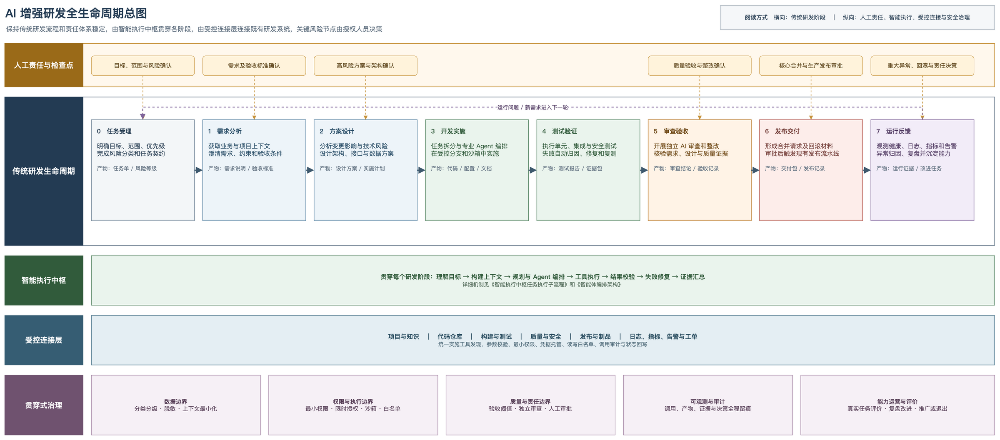
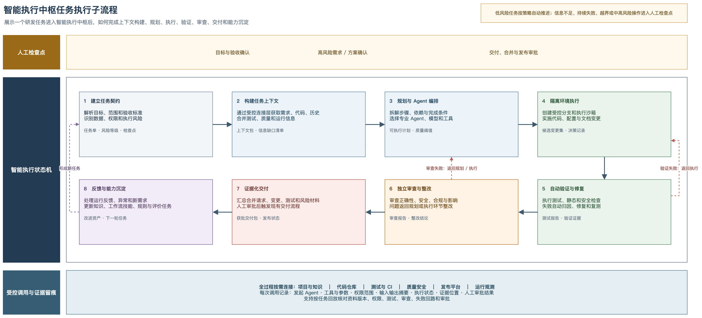
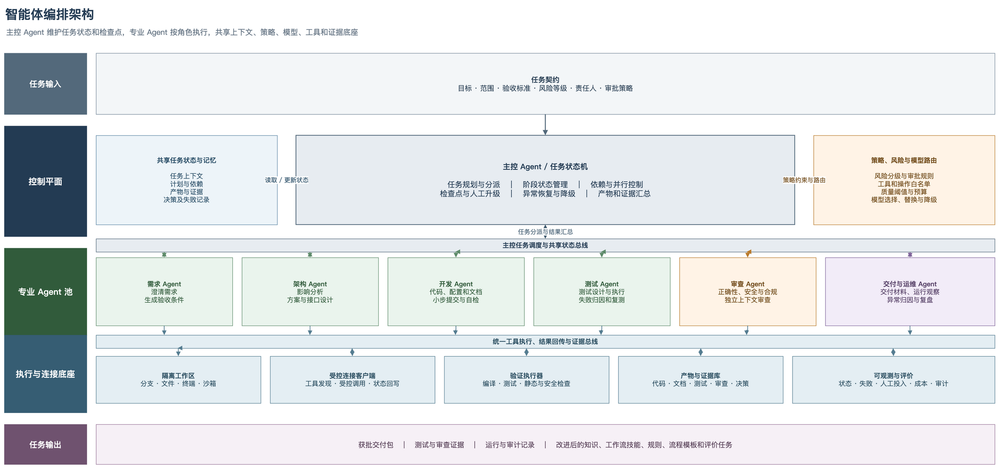
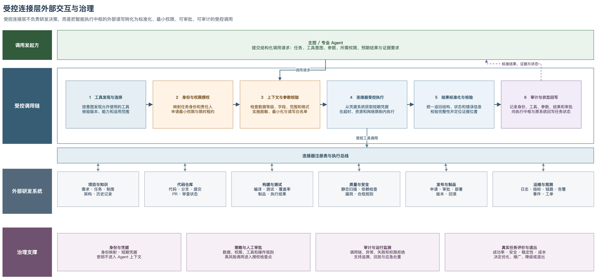

# 从单点辅助到可信协同：金融科技 AI 研发工作流设计与实践

> 本文对业务系统、技术平台、模型和工具名称作功能化匿名处理。

## 摘要

人工智能已经可以辅助分析需求、编写代码、生成测试和开展代码审查，但在实际研发中，完成一次生成并不等于完成一项任务。一个可交付的研发任务还需要明确范围，调用项目和代码资料，经过测试和审查，并按规定完成审批和留痕。针对金融科技研发流程长、涉及系统多、安全与审计要求高以及存量系统资料不完整等问题，团队建设了一套 AI 研发工作流。该工作流由智能执行中枢、受控连接层和人工检查点组成，让不同职责的智能体（Agent）在规定范围内完成分析、开发、测试和审查，并以实际代码、测试结果、审查记录和审批状态证明任务已经完成。

目前，AI 代码审核和研发系统受控连接等基础能力已经投入使用，需求、设计、开发、测试、审查和交付流程已经打通，并可查看任务的执行过程。团队通过两个真实任务验证了这套方法：在一个只有约 3 万行源码和少量资料的存量金融业务系统中，完成需求梳理、重新设计、整系统重写、测试审核、内部验收和上线运行；针对开源组件漏洞，在全机构数十个项目中完成影响排查，并在试点项目中完成升级整改、测试和代码审核。从 AI 技术应用效果看，需求分析、方案设计、代码修改、测试、审核和材料汇总能够按统一任务连续推进；人员仍负责业务语义、验收标准和高风险决策，编译、测试和扫描程序负责给出可复现结果。实践说明，AI 在研发中的作用不应只看生成速度，更应看它能否在安全、质量和责任要求下完成真实任务，并把有效做法复用到更多项目。

**关键词：** 人工智能；AI 研发工作流；多智能体协同；代码审核；研发效能；自主可控

## 一、应用背景：从分散辅助走向受控交付

活动辅导材料指出，金融行业人工智能应用正由单点工具走向业务全流程赋能，并向经营管理、风险防控和智能运维等领域拓展。本项目以金融科技研发任务为切入点，把分散的需求分析、代码生成、测试和审查能力组织成连续、受控的研发工作流，是对这一趋势的具体实践。

一项金融科技研发任务通常要经过需求分析、方案设计、代码开发、测试、审查、发布和运行维护。任务信息、源代码、测试结果和审批记录往往保存在不同平台中，研发人员需要来回查找和整理资料。现有 AI 工具虽然能够解释代码或生成内容，但多数仍用于某一个环节。它不了解任务的完整过程，也不能仅凭一次回答证明代码可以运行、测试已经通过或风险已经得到处理。

当智能体开始使用代码仓库、终端和项目平台后，问题会更加突出。项目资料可能包含敏感信息，错误的操作指令可能修改不应修改的文件，过大的系统权限还会放大模型判断错误。如果没有明确任务范围、操作权限、质量要求和审批责任，自动化越深入，数据泄露、误操作和责任不清的风险就越高。

因此，本项目并不是简单增加几个 AI 功能，也不以“无人研发”为目标。团队希望在保留现有研发平台、审批流程和人员责任的前提下，让 AI 能够连续处理一项任务：需要什么资料就按权限获取，完成代码变更后自动测试和审查，遇到高风险事项交由人员决定，最后用代码、测试、审查和审批记录说明任务是否真正完成。

## 二、技术方案：智能执行、受控连接、人机协同

### （一）总体架构

这套工作流不替换现有的项目管理、代码、测试和发布平台，而是在这些平台之上增加智能执行和受控连接能力。现有平台继续保存正式任务、审批结论和责任人信息；智能执行中枢负责理解任务、安排步骤、调用专业 Agent 并汇总结果；受控连接层负责访问外部研发系统，同时检查身份、权限、调用参数并记录操作。需要人员判断的需求确认、高风险方案、代码合并和生产发布仍由相关责任人决定。

*图 1　AI 增强研发全生命周期总图（[Draw.io 源文件](../../diagrams/current/图1_AI增强研发全生命周期总图.drawio)）*

如图 1 所示，工作流仍按照任务受理、需求分析、方案设计、开发、测试、审查、交付和运行反馈推进。智能执行中枢在每个阶段承担可以交给 AI 的工作，例如整理资料、分析需求、修改代码、生成测试和汇总交付材料。受控连接层提供项目资料、代码仓库、构建测试、质量安全和运行监控等系统的访问能力。AI 可以分析和生成内容，但代码能否编译、测试是否通过、覆盖率是否达标，均由相应工具给出结果；涉及业务判断和高风险操作时，必须由授权人员确认。

### （二）研发任务如何执行

每项任务开始前，都要先写清楚要解决什么问题、哪些内容不在本次范围内、什么结果才算完成，以及哪些操作必须经过人工审批。同时，还要明确需要读取哪些资料、允许使用哪些工具、最终应提交哪些材料。系统把这份标准任务说明称为“任务契约”。它的作用是给 Agent 划定工作范围，防止任务在执行过程中偏离目标。每个可复用节点都按同一套规则配置：明确输入资料、责任角色、允许工具、结构化输出、质量门禁、人工检查点和失败去向。

任务开始后，受控连接层根据权限读取需求、代码、历史修改、测试结果和运行信息。主控 Agent 根据这些材料拆分工作步骤，并把需求分析、设计、开发、测试和审查工作分配给相应的专业 Agent。如果资料不足，系统会明确指出缺少什么信息，而不是自行补造结论。

代码、配置和文档修改均在隔离的工作分支和受控环境中进行。修改完成后，系统自动执行编译、单元测试、集成测试、静态检查和安全检查。检查失败时，工作流先判断问题出在哪个环节，再返回相应步骤修改并重新验证。自动检查通过后，独立的审查 Agent 再检查实现是否符合需求，是否存在安全、合规或变更影响方面的问题。

只有实际修改、测试结果、审查结论和必要的人工审批均已具备，任务才会进入交付阶段。系统会把变更说明、测试报告、审查问题及处理结果、发布方案和回滚措施整理到一起，方便责任人验收。任务完成后的运行情况和失败记录还会用于调整规则和流程，减少同类问题再次发生。

*图 2　智能执行中枢任务执行子流程（[Draw.io 源文件](../../diagrams/current/图2_智能执行中枢任务执行子流程.drawio)）*

不同 Agent 之间不直接传递冗长的对话记录，而是通过需求说明、设计方案、代码差异、测试报告和审查结论交接。每份材料都标明来源、版本、适用范围和确认状态，避免后续环节使用过期或未经确认的信息。对于耗时较长的任务，系统会保存当前步骤、已完成材料和检查结果，以便中断后继续执行，也便于事后查看完整过程。

过程回放不是重新展示模型对话，而是按任务核对每一步使用了哪些资料和版本、调用是否符合权限、测试和审查是否真实执行、失败是否返回正确环节以及人工审批是否落实。这样既能说明任务如何完成，也便于出现问题后定位原因和责任。

任务是否完成不能由模型自己判断。系统必须看到与任务对应的实际修改，以及可以复现的测试和检查结果；独立审查提出的严重问题必须完成整改，需要人工批准的事项也必须具有明确结论。需求不清楚就返回需求确认，设计或兼容性有问题就返回方案设计，代码和测试失败则回到开发或测试环节。连续失败或风险上升时，系统停止自动处理并交由人员决定下一步。

### （三）多智能体协同与独立审查

平台没有让一个 Agent 从头到尾处理所有工作，而是按照研发职责设置主控 Agent 和多个专业 Agent。主控 Agent 负责安排任务、跟踪进度、处理异常和汇总结果；需求、架构、开发、测试、审查、交付和运维 Agent 分别处理各自擅长的工作。它们共享经过权限控制的任务资料和阶段成果，但项目的正式状态、审批结论和责任人仍以现有研发平台中的记录为准。

*图 3　智能体编排架构（[Draw.io 源文件](../../diagrams/current/图3_智能体编排架构.drawio)）*

平台可以根据任务类型、数据敏感程度、模型稳定性、使用成本和操作风险选择不同模型，但允许使用的工具、审批规则和质量标准始终由团队管理。开发和审查由不同 Agent 承担。审查 Agent 不直接接受开发 Agent 的判断，而是重新对照原始需求、实际代码和测试结果进行检查，以减少“自己开发、自己证明正确”带来的偏差。

### （四）受控连接层

Agent 不能直接持有各研发系统的账号和密码，也不能绕过权限控制访问数据。所有外部访问都要经过受控连接层。该连接层会先确认调用人和任务身份，再检查所用工具、访问范围和参数是否符合规定，调用完成后还要检查返回结果并记录操作。外部系统凭据由连接层或现有凭据系统统一保管，不写入提示词、代码或 Agent 的长期记录；涉及高风险写入时，必须先获得人工授权。

一次受控调用依次经过工具发现与选择、身份与分级授权、上下文和参数校验、连接器受控执行、结果标准化与完整性检查，最后完成调用审计和任务状态回写。受控连接层只负责把经过批准的外部能力变成可管理的工具调用，不代替智能执行中枢作出研发决策。

受控连接层根据操作影响区分三类访问。需求、代码和测试结果查询属于只读操作，按任务范围授权；创建分支、提交状态回写等普通写入还要经过工具白名单和参数检查；代码合并、生产发布、生产数据及权限变更属于高风险操作，必须由责任人审批。这样的分级使 AI 获得完成任务所需的能力，又不会取得长期、过大的系统权限。

*图 4　受控连接层外部交互与治理（[Draw.io 源文件](../../diagrams/current/图4_受控连接层外部交互与治理.drawio)）*

目前，受控连接层已经能够访问项目与知识、代码仓库等研发平台，并按权限读取或回写任务、代码和状态信息。整个流程已经可以连续运行，关键操作也有记录可查。不过，不同环节的长期成功率、常见失败原因和人工介入比例仍在持续统计。流程已经打通，并不意味着所有环节都已达到同样的稳定程度。

### （五）贯穿开发与交付的 AI 代码审核

AI 代码审核是工作流中的公共质量检查，而不是一个单独案例。开发人员提交代码或发起合并请求后，平台通过受控连接层获取本次代码差异、相关文件、任务说明和项目规则。审查 Agent 检查功能正确性、安全问题、异常处理、边界条件、并发与资源使用、代码可维护性、测试是否充分以及修改可能影响的范围，并把问题位置、严重程度和修改建议写回代码平台。严重问题必须返回开发环节整改，一般问题由人员确认如何处理。除每次提交自动触发审核外，平台还可以按计划对项目进行全量扫描。

这项能力同时服务两个案例。在存量系统重写中，它用于检查新代码是否符合已经确认的需求和设计；在组件漏洞整改中，它用于确认漏洞是否消除、依赖是否完整升级以及是否出现兼容性问题。日常项目也可以使用同一套审核流程，已经处理的问题会继续用于完善后续审核规则。

### （六）研发交付与能力运营双闭环

这套工作流同时运行两个闭环。研发交付闭环按照任务、需求、设计、开发、测试、审查、交付和运行反馈推进，负责完成具体研发任务；能力运营闭环根据运行记录评价成效、复盘失败、更新能力并再次验证。每次任务都会留下代码、文档、测试和审查记录，团队据此判断哪些知识、规则、工具和流程确实有效，哪些环节容易失败或需要人工介入。有效做法经过再次验证后用于更多项目；效果不稳定或风险过高的能力则会被调整、降级或停用。这样，工作流不是一次建成后固定不变，而是在真实任务中逐步完善。

## 三、实践案例一：某存量金融业务系统的需求逆向与整系统重构

### （一）案例背景

某存量金融业务系统已经运行多年，熟悉原系统的人员和设计资料不足，能够使用的主要材料是约 3 万行源码和少量项目文件。现有需求文档有缺失，也有部分描述与代码实际行为不一致。大量业务规则分散在数据校验、接口调用和页面交互代码中。按照传统方法，研发人员需要逐个文件阅读，再依靠个人经验还原系统功能，不仅耗时，也容易遗漏规则和低估修改影响。

本次项目不是简单整理旧代码，也不是让 AI 直接生成一套新系统。团队先从代码中还原可以核实的需求，再由业务人员确认关键规则，在此基础上重新设计并重写整个系统。项目已经完成需求、设计、开发、单元测试、集成测试和代码审核，通过内部验收后上线，目前运行正常。

### （二）实施过程

项目开始时，团队先明确系统范围、需要恢复的业务功能、验收要求和安全限制。为了让 Agent 能够处理较大的代码库，平台按照模块、调用关系和依赖关系整理源码。Agent 每次只读取当前任务需要的部分，并记录代码来源和版本，避免因为一次输入过多而遗漏关键信息。

围绕这项任务，团队将全过程设置为需求与设计、测试驱动开发、集成验证和交付提交四道质量门禁。每道门禁都有明确交付物、独立审查和失败返回条件，未通过当前门禁不进入下一阶段。

随后，需求 Agent 从源码中查找业务规则、校验条件、接口行为和页面流程，形成需求说明初稿。每项结论都注明是可以由代码直接证明、根据代码作出的推断，还是需要人员进一步确认。独立的需求审查 Agent 再检查内容是否完整、能否测试以及是否存在安全问题，关键业务含义由业务人员最终确认。这样做可以利用代码恢复需求，又不会把历史代码中的所有行为都直接当作正确需求。

开发采用测试驱动方式。团队先根据已经确认的需求编写单元测试，确保测试能够发现尚未实现的功能或错误行为，再编写代码直至测试通过。独立审查角色会检查测试是否覆盖主要业务规则和边界情况，也会识别没有有效断言、只为提高覆盖率而编写的无效测试。项目设置了不低于 80% 的单元测试覆盖率要求，具体统计范围以项目测试报告为准。

单元测试通过后，团队围绕跨模块业务流程开展集成测试和浏览器自动化冒烟测试。发现问题时，先补充能够复现问题的测试，再修改代码并重新运行相关测试。阻断和严重问题必须整改并重新审查。代码提交后还会自动触发 AI 审核，检查功能正确性、安全性、异常处理和项目规则。只有单元测试、集成测试、覆盖率和严重问题处理均达到要求，项目才进入人工验收和上线流程。

### （三）交付结果与创新价值

项目最终交付的不只是新系统代码，还包括经过确认的需求和业务规则、系统结构和接口说明、单元测试和集成测试、代码审查报告，以及部署、回滚和维护交接材料。原来分散在源码和个人经验中的系统知识，被整理成后续维护人员可以直接查阅的文档和测试。

该案例说明，AI 可以参与复杂存量系统从理解到重建的完整过程，但前提是每一步都有明确输入、检查要求和责任人。AI 从代码中提出需求，业务人员确认关键含义；测试把确认后的需求转化为可以自动检查的标准；独立审查再判断实现是否偏离目标。项目中验证有效的代码读取、需求核对、测试和审核方法，随后被纳入通用工作流，供其他项目复用。

## 四、实践案例二：开源组件漏洞全机构排查与试点整改

### （一）案例背景

金融科技系统普遍使用开源组件。收到漏洞通告后，需要尽快确认哪些项目使用了相关组件，属于直接依赖还是间接依赖，当前版本是否受影响，以及哪些项目需要优先处理。项目数量较多时，完全依靠人工查询和逐一沟通，不仅速度慢，排查结果、整改进度和剩余风险也容易散落在不同人员和系统中。另一方面，直接批量升级组件可能造成构建失败、接口不兼容或业务回归，因此不能只根据版本号自动修改。

团队在一次真实漏洞处置任务中，对全机构数十个项目进行了影响排查，并选择试点项目完成组件升级、相关代码调整、测试和代码审核。这个案例用于检验同一套工作流能否处理跨项目的安全任务。

本文所称“完成”，是指全机构影响排查已经完成，选定试点项目已经完成整改闭环；不将试点完成扩大表述为所有受影响项目均已完成整改。

### （二）实施过程

收到漏洞通告后，团队先明确漏洞等级、排查范围、完成时限和验收要求。受控连接层读取组件清单、依赖扫描结果和代码仓库信息，系统据此找出直接依赖、间接依赖和受影响版本。架构和开发 Agent 再分析可用的修复版本、接口变化、构建限制以及升级可能带来的业务影响。

工作流根据项目风险和依赖情况分别生成整改任务。试点项目的组件升级以及相关代码、配置和构建文件修改都在独立分支中完成，并依次进行构建、单元测试、集成测试和关键业务回归测试。测试失败时，系统会分析原因、调整方案并再次测试，不会为了赶进度跳过失败项。

每次整改提交都会自动进入 AI 代码审核，重点确认漏洞是否已经消除、依赖是否完整升级，以及新版本是否带来兼容性或其他安全问题。最终交付材料包括项目排查清单、影响分析、整改分支和提交记录、测试报告、审核结论、剩余风险及发布建议。项目负责人负责批准代码合并和发布；风险较高或兼容性仍不明确的项目转为专项人工处理。试点完成后，排查和整改状态写回现有平台，已验证的升级方法和常见问题用于后续项目。

### （三）案例价值

过去需要分别查询和记录的漏洞通告、组件清单、代码修改、测试结果和审核结论，在这次任务中被放到同一流程中管理。系统可以为不同项目分别安排任务，但每个项目仍要单独测试、审查和审批，避免一次自动操作影响多个项目。最终结果不仅是试点项目完成了组件升级，还明确了全机构受影响范围、已经处理的项目、验证结果和仍需关注的风险，为后续整改提供了统一依据。

该案例也说明，工作流不依赖某一个模型、扫描工具或代码平台。外部系统通过受控连接层接入，同一套排查、测试和审核方法可以在不同项目中复用。AI 代码审核既用于系统重写和漏洞整改，也可以服务日常研发。

## 五、实施效果：从真实交付到组织能力

### （一）已确认的状态变化

两个案例和公共代码审核能力形成了可以核验的实际结果。

| 评估对象 | 实施前的主要问题 | 已确认结果 | 判断依据 |
| --- | --- | --- | --- |
| 存量系统需求与设计 | 资料缺失或与代码不一致，业务规则依赖源码和个人经验 | 形成经审查和人工确认的需求、规则、系统结构和接口说明 | 需求说明、审查记录和设计文档 |
| 存量系统研发交付 | 测试和回归保障不足，系统知识难以继承 | 完成整系统重写、测试、代码审核和内部验收，并已上线正常运行 | 测试报告、审核记录、验收及上线记录 |
| 开源组件漏洞处置 | 影响范围、整改进度和验证材料分散 | 完成全机构数十个项目的影响排查，并完成选定试点项目整改 | 影响清单、整改分支、提交、测试和审核记录 |
| 代码质量控制 | 代码检查依赖人员主动发起或分散进行 | 提交触发和定时全量扫描的 AI 代码审核能力已经投入使用 | 代码平台审核与问题处置记录 |
| 跨平台流程协同 | 任务资料和阶段结果需要人工反复查找、传递 | 主要研发流程和受控连接已经打通，关键过程可以按任务回放 | 任务日志、工具调用和审批记录 |

这些结果说明，工作流既能处理单个复杂系统的完整重写，也能处理跨项目的安全排查。任务所需资料由系统按步骤获取和传递，测试与代码审核跟随每次修改执行，问题可以在交付前被发现并返回相应环节处理。经过验证的需求分析方法、测试规则、审核规则和流程模板还可以用于后续项目，减少重复建设。

### （二）AI 技术应用效果

项目实施效果回答最终交付了什么，上表中的系统上线、漏洞排查和试点整改属于这一类结果。AI 技术应用效果则回答 AI 实际承担了哪些工作，原有工作方式发生了什么变化，以及这些工作如何被验证。

在存量系统案例中，AI 参与了源码结构化梳理、需求逆向、方案分析、代码实现、测试设计、问题修复和独立审查，使原来需要人员逐文件阅读、分散传递的工作能够围绕同一任务连续推进。需求说明、代码差异、测试报告、审查结论和人工确认记录共同证明 AI 实际参与了任务，而不是仅提供一次性建议。

在漏洞处置案例中，AI 参与了依赖影响识别、兼容性分析、项目级整改规划、代码和配置修改、测试失败分析、代码审核和证据汇总，将原来分散的项目清单、代码、测试和整改状态放到同一流程中。低风险且可验证的步骤可按任务连续推进，但业务语义、高风险操作、代码合并和生产发布仍由人员负责。

### （三）成效评价与推广依据

项目成效以真实任务是否完成为主要依据，而不是统计 AI 生成了多少代码或调用了多少次。目前可以确认的是，代码审核和受控连接等基础功能已经投入使用，两个案例已经完成各自任务，整体流程也已经打通并支持回放。各环节的长期成功率、人工介入次数、运行成本和稳定性仍需继续积累数据，因此本文没有采用“效率提升数倍”等缺少统一基线的结论。

后续每项量化结论都应同时说明统计周期、样本范围、计算口径和证据来源。重点观察任务完成率、一次通过率、人工接管情况、交付周期、测试通过率、覆盖率、审核有效问题、权限拒绝或越界拦截以及单任务综合成本。在形成可比基线前，优先报告可以核验的绝对结果和脱敏案例，不用推算比例代替事实。

## 六、风险控制：安全、合规与责任边界

金融科技研发首先要控制数据使用范围。团队对源码、需求、设计、测试和运行信息进行分类分级，Agent 每次只能获取完成当前任务所需的内容。内网环境可以在授权范围内使用原始材料；需要在外部环境使用的材料必须先完成脱敏。未经处理的源码、业务数据、账号凭据和安全配置不在不同网络环境之间直接传递，模型服务产生的日志、缓存和中间文件也按照同样的分类分级要求管理。

所有外部系统访问均遵循最小权限原则。受控连接层根据任务和人员身份授予限时权限，并检查调用参数和读写范围。账号凭据集中保管，不出现在提示词和代码中。代码修改只在隔离分支和安全环境内进行，能够使用的终端命令、网络地址、文件和工具都有明确限制。AI 不直接修改生产数据，也不能绕过原有的合并、发布和审批流程。

质量检查不能由模型自行完成。代码必须经过编译、测试、覆盖率检查、安全扫描和独立审查；资料不足、连续失败或风险上升时，系统停止自动执行并转交人员处理。业务含义、验收标准、高风险方案、核心代码合并、生产发布以及生产数据和权限变更，仍由具有相应职责的人员决定。

系统会记录任务使用了哪些资料、模型和工具，执行了哪些操作，产生了哪些结果，以及由谁审批和处理。团队可以据此复查问题，也可以判断某项 AI 能力是否适合继续使用。对于技能、扩展、软件包和连接器等外部依赖，还要进行准入审查、版本锁定、漏洞检查和变更记录，发现风险时可以立即停用。

这里所说的“自主可控”并不等于没有人员参与，而是指流程、数据、规则、权限和审计记录由本方管理，模型和工具可以根据需要替换，AI 能够自动处理到什么程度由任务风险决定。

## 七、创新特点与推广价值

本项目的创新不在于使用了更多 AI 工具，而在于把这些工具组织成一套可以完成真实任务的研发流程。每个环节都写清输入资料、允许操作、交付内容、检查标准和责任人。AI 生成的内容只有通过测试、审查和必要审批后，才能进入下一阶段。这样，AI 不再只提供建议，而是能够在明确边界内承担部分研发工作。

智能执行中枢、受控连接层和现有研发平台各自承担不同职责。智能执行中枢负责任务安排和执行，受控连接层负责安全访问外部系统，现有研发平台继续保存正式任务和审批结果。这种分工既方便替换模型和工具，也避免 AI 获得不必要的系统权限。开发和审查由不同 Agent 完成，测试和扫描由程序给出客观结果，重要决定仍由人员负责。

两个案例中形成的需求梳理、代码读取、测试、审核和问题处理方法，已经能够用于后续任务。推广时，团队将优先选择测试补充、代码审核、变更影响分析、存量系统梳理和漏洞排查等结果容易验证的场景，先在少量项目中观察任务质量、安全风险、人工投入和使用成本。确认有效后再逐步扩大范围；效果不稳定、风险过高或管理成本过大的能力则及时调整或停用。

面向赛事后续的成果展示和转化，可优先准备经过脱敏的总体架构与任务流程图、需求逆向示例、测试报告、代码审核记录和任务回放摘要。可复制的内容不是某一个模型，而是需求逆向方法、质量门禁、测试资产、审核规则、流程模板和受控连接方法。这些能力推广到其他项目时，仍要具备数据授权、环境隔离、工具接入、质量标准和人工责任等基本条件，并根据案例验证、实际投入使用和稳定性统计的成熟程度确定推广范围。

## 八、结语

AI 在研发中的价值，不只是生成更多代码，而是帮助团队在规定的安全和质量要求下完成真实任务。在存量系统重写中，工作流帮助团队从源码恢复需求，并通过测试、独立审查和人工确认保证新系统符合目标；在组件漏洞处置中，同一套方法完成了跨项目排查和试点整改，也控制了批量修改带来的风险。

目前，两个案例均已完成实际任务，代码审核和受控连接等基础功能已经投入使用，主要研发流程也已经打通并支持过程查询。与此同时，各环节的长期稳定性和量化成效仍需通过持续运行数据验证。后续建设将继续以真实任务结果为依据，在保证数据安全、质量要求和人员责任的前提下，把已经验证有效的方法推广到更多研发场景。
